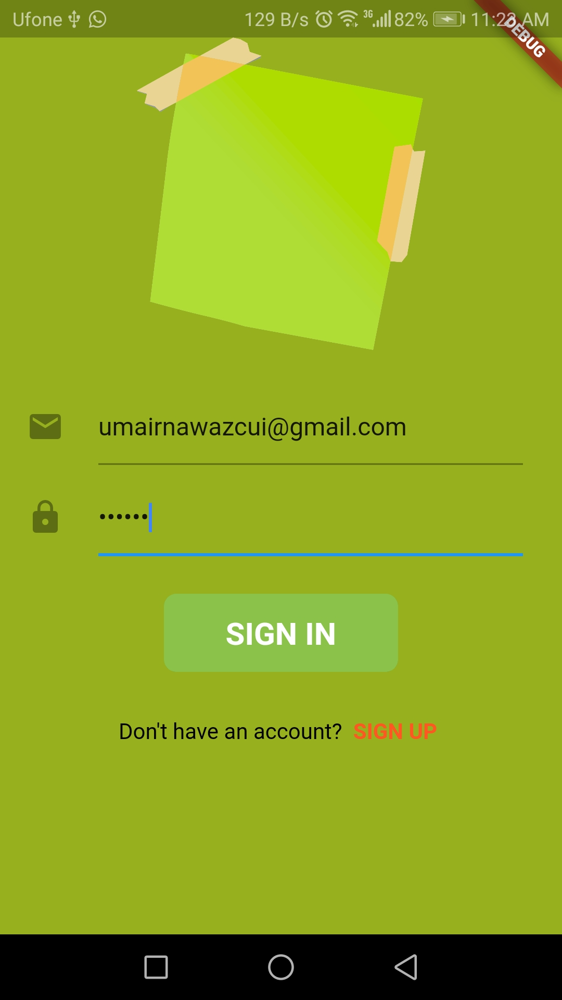

# Note Taking App - Flutter
> Mobile App Development LAB Final
> Umair Nawaz - SP17-BCS-053

## Features:

* Attractive UI and ICON.
* SignUp and SignIn With Email using FIREBASE
* Attractive UI and ICON.
* Multiple Screens
* Start With Splash Screen.
* Create Notes 
* Save Notes with Date & Time.
* Edite Notes
* Share Notes using Whatsapp ,etc
* Search within Notes.
* Set Flag for Filter
* Attractive UI... 

## GIF:
<kbd></kbd>

## ScreenShots:
<kbd></kbd>
<kbd></kbd>
<kbd></kbd>
<kbd></kbd>
<kbd></kbd>
<kbd></kbd>
<kbd></kbd>
<kbd></kbd>

 For Upcoming Apps, Follow me 
[`umairnawaz333`](https://github.com/umairnawaz333) 
